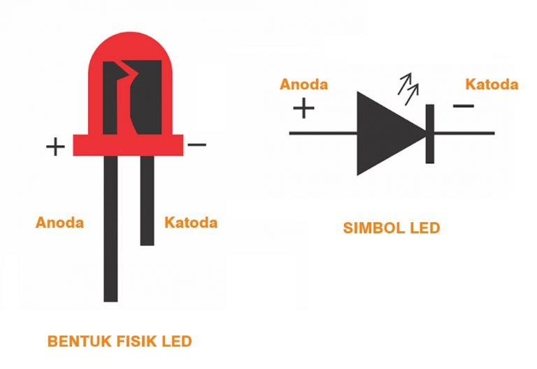

# Earthquake-Sensor

A simple **earthquake detection and current detection circuit** using a **2N2222 transistor, resistor, LED, buzzer, and 2P connector**.

The circuit is designed to detect vibration or movement associated with an earthquake and provide **visual and audio warnings** through an LED and buzzer. The same circuit can also be used as a simple current detector through the 2P connector.

---

## List of Content

- [Introduction](#Introduction)
- [Literature](#Literature)
- [Design](#Design)
- [Programs](#Programs)
- [Result](#Result)

---

## Introduction

This project develops a simple **earthquake detection sensor** using basic electronic components.

The circuit is designed to detect vibration or movement and provide an alert through an LED and buzzer. A **2N2222 NPN transistor** is used as the main control component, while the LED and buzzer act as visual and audio indicators.

The circuit can also function as a **current detector**. The 2P connector can be connected to an electrical component or device, allowing current to activate the LED and buzzer indicators.

The main objectives of this project are:

1. To understand the earthquake detection sensor circuit.
2. To build an earthquake detection sensor circuit.
3. To use and understand the working principle of the earthquake detection sensor.

---

## Literature

### Earthquake Detection Sensor

An earthquake detection sensor is an electronic device designed to detect vibration or ground movement caused by an earthquake or other seismic disturbances.

In this project, the sensor circuit works together with a **2N2222 transistor, LED, buzzer, and current detection connector**. When the sensor detects significant vibration or movement, the resulting electrical signal activates the transistor and triggers the LED and buzzer.

### 2N2222 Transistor

<p align="center">
  
</p>

The **2N2222** is an NPN bipolar junction transistor with three terminals: **Emitter (E), Base (B), and Collector (C)**.

In this project, the transistor functions as the control element of the circuit. A signal from the earthquake sensor is applied to the transistor, allowing the transistor to control the current flowing to the LED and buzzer.

### LED

<p align="center">
  
</p>

The **Light Emitting Diode (LED)** functions as a visual indicator.

When the circuit detects a significant vibration or electrical current, the LED is activated to provide a visual warning to the user.

### Buzzer

<p align="center">
  
</p>

The buzzer functions as an **audio warning indicator**.

When the sensor detects vibration or when current activates the circuit, the buzzer produces a sound to notify the user of the detected condition.

---

## Design

### Hardware Design

<p align="center">
  
</p>

| Component | Quantity | Function |
|:---|:---:|:---|
| **PCB** | 1 | Main circuit board |
| **LED** | 1 | Visual indicator |
| **2N2222 Transistor** | 1 | Signal control and amplification |
| **5V Active Buzzer** | 1 | Audio indicator |
| **9V Battery** | 1 | Power source |
| **330k Resistor** | 1 | Controls current in the circuit |
| **2P Connector Cable** | 1 | Sensor/current connection |
| **Male Header** | As needed | Electrical connection |
| **Solder** | As needed | Component assembly |
| **Soldering Iron** | 1 | Circuit assembly |

The component list is based on the equipment and materials specified in the project report.

### System Workflow

```text
Vibration / Current
        ↓
    2P Connector
        ↓
    2N2222 Transistor
        ↓
   ┌────┴────┐
   ↓         ↓
  LED      Buzzer
   ↓         ↓
Visual     Audio
Warning    Warning
```

### Working Principle

The circuit uses a 2P connector as part of the detection mechanism.

When the connector becomes connected as a result of vibration or when it is connected to a component carrying electrical current, current flows toward the **2N2222 transistor**.

The transistor then controls the current flowing to the indicators. When activated:

- The **LED turns on** as a visual warning.
- The **buzzer produces sound** as an audio warning.

This allows the circuit to provide both visual and audio indications.

### Current Detection

In addition to earthquake detection, the circuit can function as a simple **current detector**.

The 2P connector can be connected to an electrical component or device. When electrical current flows through the connector, it activates the circuit and causes the LED and buzzer to turn on.

---

## Programs

This project **does not require a microcontroller or software program**.

The detection and warning process is performed entirely through the electronic circuit using the transistor, resistor, LED, buzzer, and 2P connector.

### Procedure

1. Prepare the required components.
2. Build the circuit according to the schematic.
3. Solder the components onto the PCB.
4. Connect the 2P connector.
5. Check whether the circuit functions correctly.
6. Perform the detection experiment.
7. Analyze the resulting LED and buzzer response.

The project procedure consists of preparing the components, creating the schematic, soldering the circuit onto the PCB, connecting the 2P connector, checking the circuit, conducting the experiment, and analyzing the results.

---

## Result

The experiment demonstrates that the circuit can provide visual and audio indications when the detection mechanism is activated.

| Condition | LED | Buzzer |
|:---|:---:|:---:|
| **Detection inactive** | OFF | OFF |
| **Detection active** | ON | ON |

When the 2P connector is connected and current flows through the circuit, the transistor activates the LED and buzzer.

The resulting circuit therefore provides two types of warning:

- **LED** → visual indication
- **Buzzer** → audio indication

The project report includes experimental results showing the sensor circuit in both **ON** and **OFF** conditions.

### Sensor ON

<p align="center">
  
</p>

The sensor circuit is active and the indicator components are turned on.

### Sensor OFF

<p align="center">
  
</p>

The sensor circuit is inactive and the indicator components are turned off.

---

